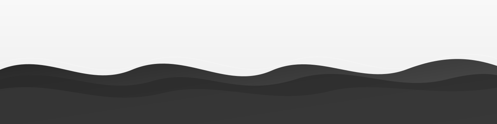

  

<h1>Siddharth Shah</h1>

<strong>Python Developer</strong> • <strong>Web App Builder</strong> • <strong>AI Explorer</strong>

  

  
  
  
  

 

  
  

 

<h2 align="center"> <em>About Me</em></h2>

<table align="center" width="100%">
  <tr>
    <td width="68%" valign="top">
      

        I am <strong>Siddharth Shah</strong>, a developer focused on Python, practical web applications, and AI learning.
        I enjoy building useful projects that strengthen real-world problem solving, design clarity, and collaboration.
      

      

        <strong>Focus:</strong> Python Development, Web Apps, LLMs, AI Tools 
        <strong>Currently Learning:</strong> Python and Ollama (LLM) 
        <strong>Working Style:</strong> Clean architecture, practical execution, continuous iteration
      

    </td>
    <td width="32%" align="center" valign="middle">
      
    </td>
  </tr>
</table>

 

<h2 align="center"> <em>Quick Highlights</em></h2>

  Clean code • Product mindset • Monochrome identity • Collaboration-ready

 

<h2 align="center"> <em>Technologies</em></h2>

  
  
  
  
  
  

 

<h2 align="center"> <em>GitHub Statistics</em></h2>

  
  

 

<h2 align="center"> <em>Most Used Languages</em></h2>

  
  

 

<h2 align="center"> <em>Contribution Graph</em></h2>

  

 

<h2 align="center"> <em>Profile Snapshot</em></h2>

  

 

  <i>Open to collaborations, internships, and project partnerships.</i> 
  <strong>Let us build something meaningful.</strong>

